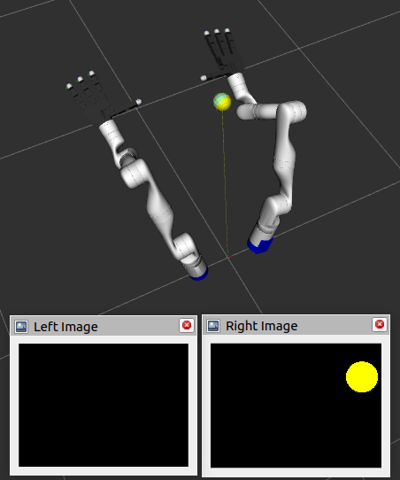
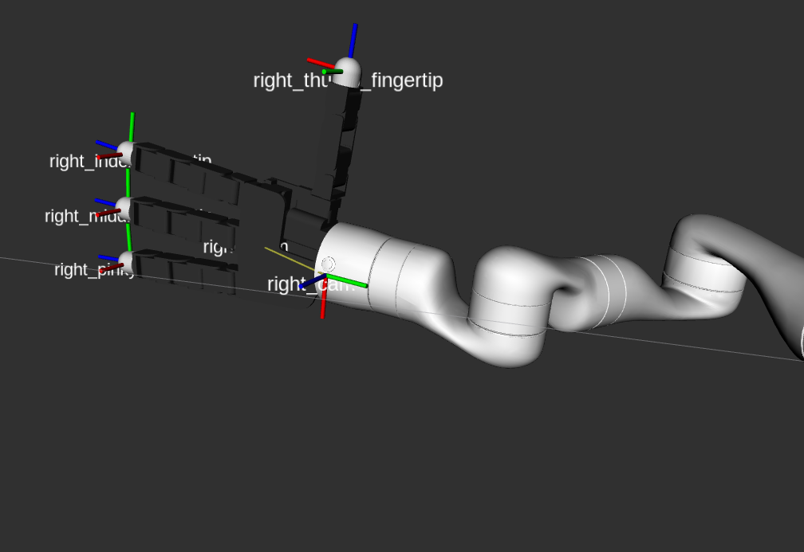

# Bi-ManualManipulation

# Overview

The goal of this project was to sketch a ROS 2 pipeline for Bi-Manual Manipulation, particularly the task of hand-to-hand transfer of an object.
Here, two 7-DoF Kinova Arms symmetrically attached to two left and right-handed 16-DoF Allegro Hands, with depth wrist mounted depth cameras (complete with simulated camera intrinsics) pick up a ball, hand it off to the other hand, and then drop it in a fixed "bin".
The left and right limbs (arm + hand systems) function independently.
16-DoF (4-fingered) Allegro Hands are abstracted to be 5-DoF systems (4 finger curling + thumb abduction), where the closure is interpolated between fully extended and fully flexed states for each finger.
7-DoF arms can travel to arbitrary *SE(3)* poses in the workspace using final-pose IK (via KDL) and joint-space inteprolation.
The CV pipeline creates a simple HSV mask to locate the object relative to the camera, which when coupled with the TF tree, gives the object pose in the world frame.

## Usage
```
ros2 launch bimanual_planner task_manager.launch.py
```

https://github.com/user-attachments/assets/a8b4cfd2-60b2-4f3d-873c-a148ca846c22

# System Design

.png>)

<br>

# Packages

## `bimanual_mockup` package
Simulates **camera physics**, **contact physics**, and **gravity**.
Acts as a cold-swappable mock-up of an actual physics engine based simulator.
Respawns object randomly within a window when object is placed in the bin.

Node `world_mockup.cpp` uses `camera_params.yaml`, `object_params.yaml`, and `world_params.yaml`.

```
ros2 launch bimanual_mockup world_mockup.launch.py camera_placeholder:=true use_rviz:=true
```
`camera_placeholder` places dummy TFs for testing camera physics when robot is not loaded.

## `bimanual_sensor` package
Uses computer vision to find the absolute position of the ball-like object, by making an HSV mask.

Node `object_sensor_node.py` uses `cv_params.yaml`.

```
ros2 launch bimanual_sensor object_sensor.launch.py camera_placeholder:=true use_rviz:=true
```



<br>

## `bimanual_controller` package
Simulates motion control (task-space and joint-space) commands for the 4-finger (5-DoF) Allegro Hands and 7-DoF Kinova Arms, set up together as a symmetric bi-manual system with wrist mounted cameras.
Also launches the `robot_state_publisher` and houses the bi-manual system's xacro file.

Hosts the following action servers:
- `move_arm_to_pose`: Uses IK along with joint-space interpolation to move the 7-DoF arms to any *SE(3)* pose in the workspace.
- `grasp_until_contact`: Flexes each finger until they independently establish contact with the object, measured via the binary tactile sensors, or until the desired closure is reached.
- `release_grasp`: Extends each finger to a desired extension.

Node `limbs_mockup_node.py` uses `grasp_params.yaml`, and `motion_params.yaml`.

```
ros2 launch bimanual_controller limbs_mockup.launch.py use_rviz:=true
```
https://github.com/user-attachments/assets/bf7a84b6-1420-491f-9eb0-f3434e344371



<br>

## `bimanual_planner` package

Moves the arms parallely to accomplish the task of picking up a ball form the table with the right hand, and then handing it off to the left hand to be dropped into a bin.

The sequence of actions is:
- Right arm
  - WAIT, until an object is sensed
  - Go to STANDOFF above the object
  - Go to GRASP POSE relative to the object
  - GRASP the object
  - Carry the object to the RIGHT STANDOFF of the HANDOFF pose
  - Carry the object to the RIGHT HANDOFF pose
  - RELEASE the object, triggered by left hand successfully GRASPing it
  - Go to a good pose to WATCH for objects
  - Start WAITing to find an obejct again, triggered by left hand successfully RELEASING the object into the bin
  
- Left arm
  - WAIT, until right arm GRASPs an object
  - Go to the LEFT STANDOFF of the HANDOFF pose
  - Go to LEFT HANDOFF pose, triggered by RIGHT arm reaching HANDOFF pose
  - GRASP object
  - Go to dump the object into the BIN, triggered by right hand successfully releasing the object
  - WAIT

Node `task_manager.py` uses `plan_params.yaml`.

```
ros2 launch bimanual_planner task_manager.launch.py use_rviz:=true
```

https://github.com/user-attachments/assets/813e9d8b-a3d6-445e-94a9-98527c70c8f0

<br>

## `bimanual_msgs` package

Contains custom message and action definitions used in this pipeline.

<br>

# Setup and Instructions

## REQUIREMENTS:

**TODO:** `vcs import` for dependencies
- ROS 2 Humble (This code was tested on Ubuntu 22.04+)
- ROS 2 TF2 Transformations 
  ```
  sudo apt install ros-humble-tf*
  ```
- C++ YAML Library
  ```
  sudo apt install libyaml-cpp-dev
  ```
- ROS 2 CV Bridge
  ```
  sudo apt install ros-humble-cv-bridge
  ```
- ROS 2 Image Transport
  ```
  sudo apt install ros-humble-image-transport
  ```
- Open CV (C++ and Python)
  ```
  sudo apt-get install python3-opencv 
  pip install opencv-python
  ```
- Allegro Hand for ROS 2 (`allegro_hand_description` package)
  In `src`:
  ```
  git clone -b ros2 https://gitioc.upc.edu/hands/allegro_hand_ros.git
  mv allegro_hand_ros/allegro_hand_description/ .
  rm -rf allegro_hand_ros/
  ```
  **NOTE:** Broken URDF. In `allegro_hand_description/urdf/rightAllegroHand.urdf.xacro`
  change: 
  ```
  <mesh filename="package://allegro_hand_description/meshes/link_3.0_tip.STL"/>
  ```
  to: 
  ```
  <mesh filename="package://allegro_hand_description/meshes/link_3_tip.STL"/>
  ```
- Kinova Robot Arm for ROS 2 (`kortex_description` package)
  In `src`:
  ```
  git clone https://github.com/Kinovarobotics/ros2_kortex.git -b main
  mv ros2_kortex/kortex_description/ .
  rm -rf ros2_kortex/
  ```
- Kinematics and Dynamics Library (KDL) Parser (`kdl_parser` and `kdl_parser_py` package)
  ```
  sudo apt install ros-humble-kdl-parser-py
  ```
  In `src`:
  ```
  git clone git@github.com:ros/kdl_parser.git -b humble
  ```
  **NOTE:** Broken package `kdl_parser_py` meant for ROS 1. Adapt this to ROS 2 by:
  ```
  cd ~/FuturHand/src/kdl_parser/kdl_parser_py
  rm CMakeLists.txt AMENT_IGNORE
  ```
  Change `setup.py` to:
  ```
  from setuptools import setup

  package_name = 'kdl_parser_py'

  setup(
      name=package_name,
      version='2.6.4',
      packages=[package_name],
      install_requires=['setuptools'],
      zip_safe=True,
      maintainer='Your Name',
      maintainer_email='your@email.com',
      description='Python parser for KDL trees from URDF models',
      license='BSD',
      tests_require=['pytest'],
      entry_points={},
  )
  ```
  Change `package.xml` to:
  ```
  <?xml version="1.0"?>
  <package format="3">
    <name>kdl_parser_py</name>
    <version>2.6.4</version>
    <description>Python tools to construct a KDL tree from a URDF model.</description>

    <maintainer email="you@yourdomain.com">Your Name</maintainer>
    <license>BSD</license>

    <buildtool_depend>ament_python</buildtool_depend>
    <exec_depend>urdfdom_py</exec_depend>
    <exec_depend>python_orocos_kdl_vendor</exec_depend>

    <test_depend>ament_lint_auto</test_depend>
    <test_depend>ament_lint_common</test_depend>

    <export>
      <build_type>ament_python</build_type>
    </export>
  </package>
  ```
  Add `setup.cfg`:
  ```
  [develop]
  script_dir=$base/lib/kdl_parser_py
  [install]
  install_scripts=$base/lib/kdl_parser_py
  ```
  Final skeleton should look like:
  ```
  kdl_parser_py/
    ├── kdl_parser_py/
    │   ├── __init__.py
    │   └── urdf.py
    ├── setup.py
    ├── setup.cfg
    └── package.xml
  ```
  Finally, in `urdf.py` replace:
  ```
  kdl.Joint(j.name, kdl.Joint.None)
  ```
  with:
  ```
  kdl.Joint(j.name, kdl.Joint.Fixed)
  ```

# Limitations
- `bimanual_sensor` currently only uses the right camera.
- Left hand given grasp priority duirng handoff in the simulator. Couldn't think of justifiable logic for this so defaulted to task-based priority.

# Short Term Improvements
- Integration with Isaac Sim instead of a custom mock up. Work in Progress ([branch](https://github.com/GogiPuttar/Bi-ManualManipulation/tree/setup/isaac_sim)).
- Separate package called `bimanual_configs` for managing all sorts of config files for params. 
Leads to the possibility of modular Task-Defining Configs, if managed properly.
- Unit Testing and Integration Testing of tasks using [`catch_ros2`](https://github.com/ngmor/catch_ros2)
- Pep257 and Flake8 compatible documentation for Python, passing all tests
- Doxygen compatible documentation for C++.

# Possible Avenues for Machine Learning
- Params files offer convenient representation of heuristics/tuned parameters which could benefit from a variety of learning based methods; resulting in improved grasping, image localization, sensor fusion, mid to high-level motion planning etc.
- Multi-Agent RL treating arms as two separate agents, achieving a combined goal.
- Object detection and pose estimation can be generalized to a larger variety of objects using supervised learning methods
- It is important to note that ROS 2 is a less than ideal training pipeline for RL and other such methods, given it's poor scaling to faster-than-real-time simualtion.

# Use of AI Tools
ChatGPT was used in this project for creating protoype scripts, and Doxygen formatting in `world_mockup.hpp`.

side
https://github.com/user-attachments/assets/e9db8ec5-ab15-402c-b95b-d46f3bd75851

front
https://github.com/user-attachments/assets/e010c9ab-8f5f-493a-a890-85126b13ac96

topfront
https://github.com/user-attachments/assets/84ca44f5-4265-426b-a53f-60167f12d50e

grasp
https://github.com/user-attachments/assets/7d593644-72a3-4f06-a365-11dd326f88a1


